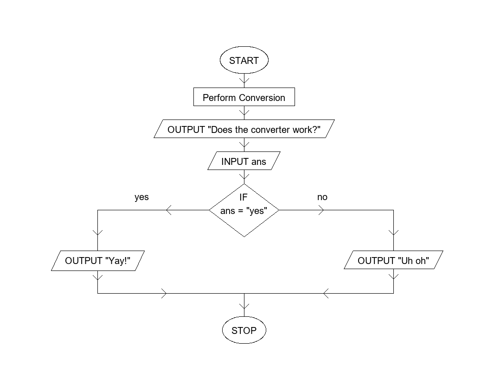

# Flowchart-Generator
Automatically converts Pseudocode into IGCSE© certified Flowcharts!



## Installation

Run this to install the dependency Pillow:

```sh 
pip install Pillow
```

Now download the two files from Github and keep them in a folder.

## Usage

### Writing the Pseudocode

The Pseudocode is entered into the enter.txt file. It follows strict rules which must be obeyed

The following statements are the only ones allowed (yet). First the syntax is given, and then examples are given after the colon.

  1. INPUT: INPUT X
  2. OUTPUT: OUTPUT X ; OUTPUT "hello"
  3. IF: IF condition THEN
  4. ELSE
  5. ENDIF
  6. Process type blocks: x = x + 1
  
STOP and START are automatically input by the program, so do not need to be added

ELSE IF is not available, but nested IFs are possible

Loops support is WIP, so is not available

### Running the Converter

Simply run the Converter.py file. There will be no printed output, but a file called Flowchart.png will be generated in its directory.
**Warning: This will overwrite previous Flowchart.png files.**

If the size of the font, and therefore the size of the flowchart itself, the user can edit the font_data variable in the main() function within Converter. By default the font is Arial at a size of 20. This can be altered to give different sized flowcharts.

### Flowchart Image

This image contains the created flowchart which can be shared, printed, etc. Its size varies exactly on the size of the flowchart created, so it may even hit a resolution of 10k pixels!

## Support

If you are having issues, please let me know. You can contact me at mugi.ganesan@gmail.com
