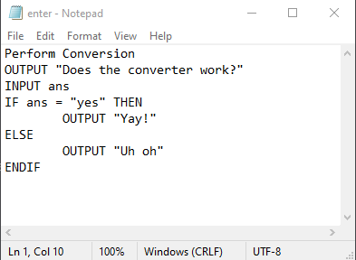

# Flowchart-Generator
Automatically creates Flowcharts from Pseudocode!

## Installation

This project was built on Python 3.7.4

Run this to install the necessary dependencies:

```sh 
pip install Pillow click
```

Next, clone this project.

## Writing the Pseudocode

The Pseudocode is entered into a .txt file. It follows strict rules which must be obeyed



The following statements are the only ones allowed (yet). First the syntax is given, and then examples are given after the colon.

  1. INPUT: INPUT X
  2. OUTPUT: OUTPUT X ; OUTPUT "hello"
  3. IF: IF condition THEN
  4. ELSE
  5. ENDIF
  6. Process type blocks: x = x + 1
  
STOP and START are automatically input by the program, so do not need to be added

ELSE IF is not available, but nested IFs are possible

The ENDIF and ELSE blocks are mandatory, and ELSE must have something inside (anything)

Loops support is WIP, so is not available

## CLI usage

To run the code, simply execute the following command:
```sh
python Converter.py
```

### Arguments
  
  Arguments in the CLI are typed like so: ```--fontsize=20``` or ```--code="enter.txt"```
 
  - ```--fontsize``` is the font size used. This controls the size of the entire flowchart as well. By default it is 20px
  - ```--font``` is the font path. Default is "C:/Windows/Fonts/Arial.ttf", but can be changed for different OSs or fonts
  - ```--output``` is the flowchart's image file. Default is "flowchart.png"
  - ```--code``` is the file with the pseudocode. Defaults to "enter.txt"
  - ```--help``` provides CLI help
  
  For example:
  
  ```sh
  python Converter.py --code="code.txt" --fontsize=30 --output="result.png"
  ```

### Flowchart Image

This image contains the created flowchart which can be shared, printed, etc. Its size varies exactly on the size of the flowchart created, so it may even hit a resolution of 10k pixels! However if the generated flowchart is too big, then the image will be unopenable due to being too large. The user should be careful with flowchart sizes.

## Support

If you are having issues, please let me know. You can contact me at mugi.ganesan@gmail.com
